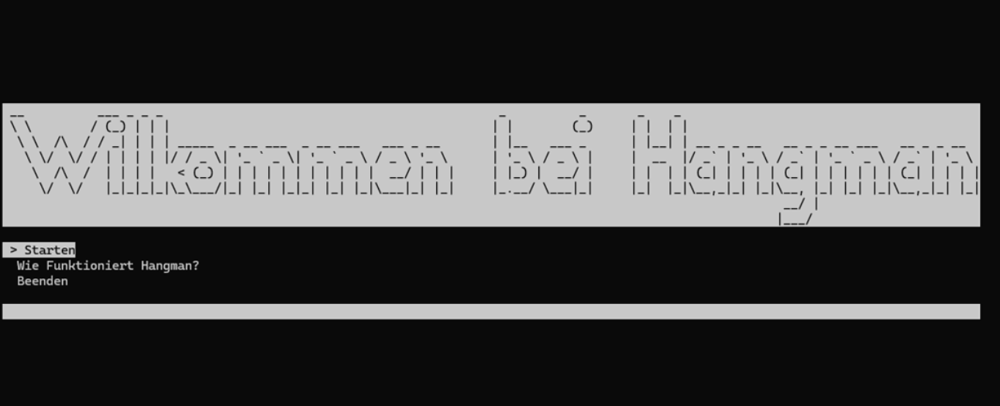
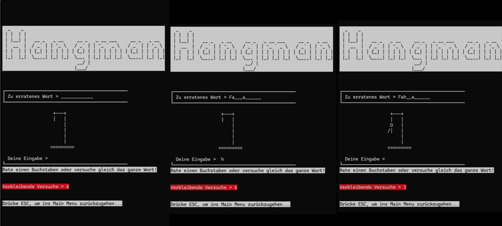
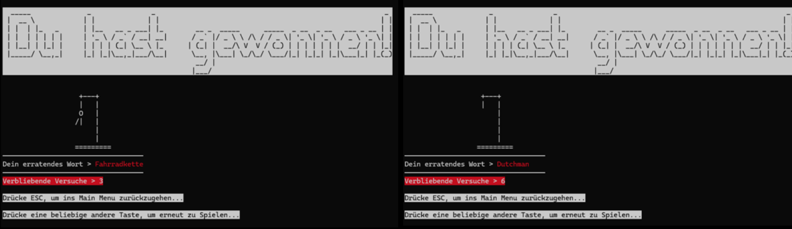
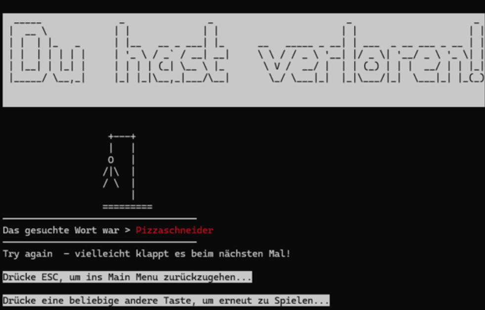

# Hangman

A console-based Hangman game written in C#.

The program recreates the classic Hangman game as a console application.  
The player's goal is to guess a randomly selected word by entering single letters or complete words before reaching the maximum number of incorrect guesses.

## Release

A prebuilt Windows release is available here:

[Download Hangman release](https://github.com/mvrtlmn/Hangman/releases)

The release contains the executable and required runtime files.

## Features

- Classic Hangman gameplay in the console
- Random word selection
- Input of single letters or complete words
- Maximum of 6 incorrect guesses
- Main menu with keyboard navigation
- Built-in explanation of the game rules
- ASCII-art based console interface
- Win and loss screens
- ESC key support to return to the main menu
- Modular project structure separating user interface, game flow and game logic

## Gameplay

At the start of the application, the console prompts the user to switch to fullscreen mode using:

```text
Alt + Enter
```

After switching to fullscreen mode, the main menu is displayed.

The player can choose between three menu options:

1. **Starten**  
   Starts a new Hangman game.

2. **Wie funktioniert Hangman?**  
   Shows an explanation of the rules and the game process.

3. **Beenden**  
   Exits the application.

During the game, the player enters either a single letter or a complete word and confirms the input with `Enter`.

The game ends when:

- the player guesses the word correctly, or
- the player uses all 6 incorrect attempts.

The `ESC` key can be used at any time to return to the main menu.

## Controls

| Key | Action |
|---|---|
| Arrow Up / Arrow Down | Navigate through the main menu |
| Enter | Confirm menu selection or input |
| ESC | Return to the main menu |
| Backspace | Delete the current input |

## Screenshots

### Main Menu



### Gameplay



### Win



### Loss



## Technical Structure

The project is structured into multiple classes to separate game logic, user interface and game control.

### `Program.cs`

The `Program.cs` file starts the application.

Main responsibilities:

- disables the visible console cursor
- checks the console window size before the game begins
- initializes the user interface

### `HangmanUI.cs`

The `HangmanUI.cs` file handles the console-based user interface.

Main responsibilities:

- displays menus
- displays the game screen
- displays ASCII-art elements
- renders win and loss screens
- shows user guidance and game status

### `HangmanGameManager.cs`

The `HangmanGameManager.cs` file controls the overall game flow.

Main responsibilities:

- checks whether the console window has been resized
- handles menu navigation
- interprets keyboard input
- starts a new game
- processes player input
- checks win and loss conditions
- resets the game state

Important methods include:

- `CheckWindowResize()`
- `InterpretMenuKeys()`
- `RunMenuAction()`
- `StartGame()`
- `AskForCharacters()`
- `ResetGame()`

### `HangmanLogic.cs`

The `HangmanLogic.cs` file contains the core game logic.

Main responsibilities:

- selects a random secret word
- processes guessed letters
- handles case-insensitive word comparison
- checks whether the word has been guessed
- creates the displayed word state using guessed letters and underscores

Important methods include:

- `ChooseRandomSecretWord()`
- `ConvertSecretWordToArray()`
- `GuessLetter()`
- `IsWordGuessed()`
- `DisplayWordWithGuesses()`

## Word Selection

The secret word is selected randomly from an embedded resource file.

This is done using `ResourceManager`, which keeps the word list separate from the main source code and makes it easier to extend the list of possible words.

## Example Game Flow

1. Start the application.
2. Switch to fullscreen mode using `Alt + Enter`.
3. Select **Starten** in the main menu.
4. Guess letters or enter the complete word.
5. Continue until the word is guessed or all attempts are used.
6. After winning or losing, return to the main menu or start another round.

## Technologies

- C#
- .NET Console Application
- Embedded resources
- ASCII-art console interface

## Project Structure

Example structure:

```text
Hangman/
├── README.md
├── Program.cs
├── HangmanUI.cs
├── HangmanGameManager.cs
├── HangmanLogic.cs
├── Resources/
│   └── WordList.resx
└── docs/
    └── images/
        ├── main-menu.png
        ├── gameplay.png
        ├── win.png
        └── loss.png
```

## Installation and Usage

Clone the repository:

```bash
git clone https://github.com/mvrtlmn/Hangman.git
```

Navigate into the project directory:

```bash
cd Hangman
```

Before building, prepare the local reference assemblies:

```powershell
python .\CI\dev-env.py
```

Then build the solution:

```powershell
.\CI\build.ps1
```

Run the application:

```bash
cd ..
.\Hangman.exe
```

## Notes

For the best user experience, run the game in fullscreen console mode.

The application is designed as a console-based project and uses keyboard input for menu navigation and gameplay.